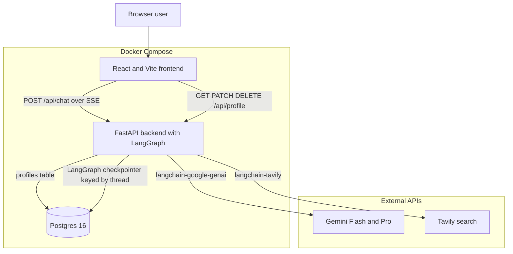
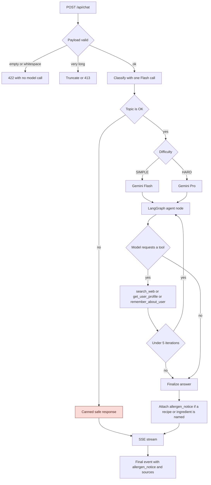
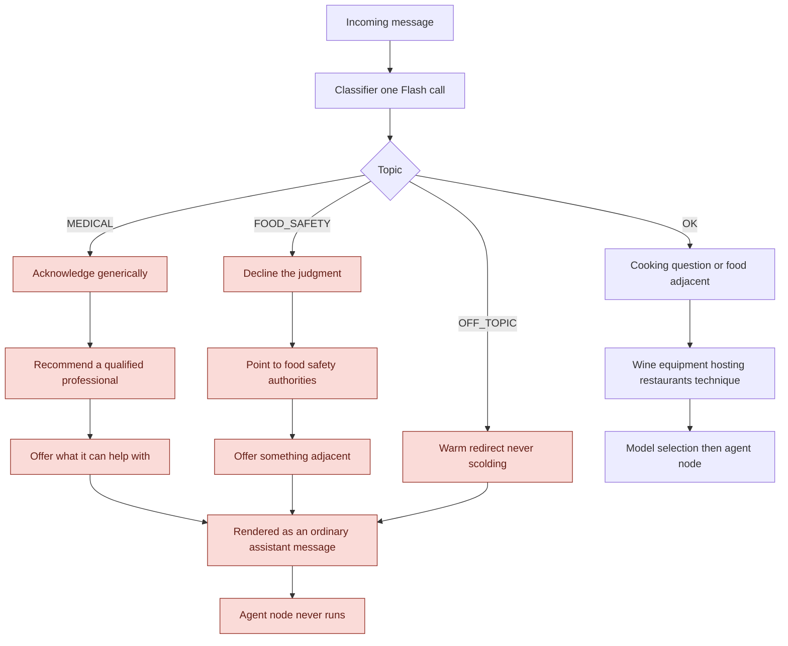
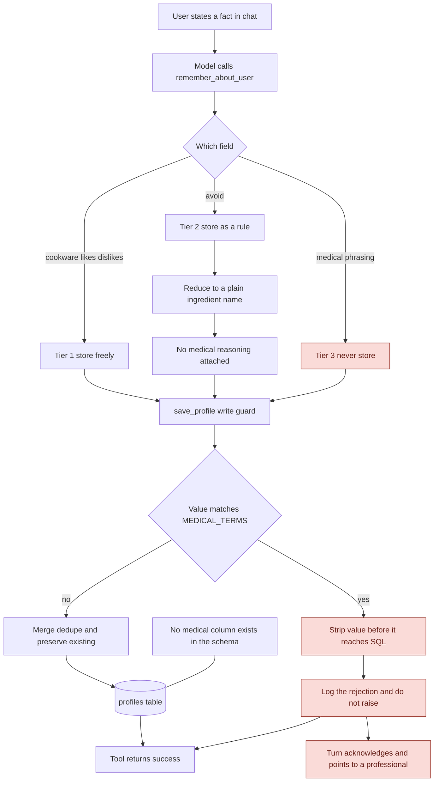
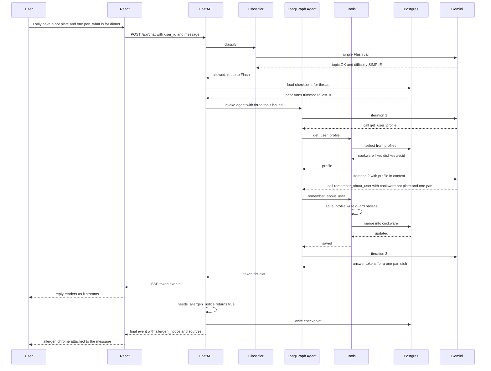

# PantryPal v1 — Architecture

Diagrams for the system specified in `PRD.md`. Every element here traces back to that document; nothing is invented. Reasoning behind the decisions lives in `SCOPING.md`.

---

## 1. System overview

Three Compose services and two outbound dependencies. The frontend never talks to Postgres or to either external API directly — everything goes through FastAPI, which is what makes the write guard in diagram 4 unavoidable rather than advisory. Postgres carries two distinct workloads: the structured `profiles` table and the LangGraph conversation checkpointer. Both Gemini tiers are reached through LangChain, never a vendor SDK, which is a hard README requirement. `/health` exists for the Compose healthcheck. Note that if Postgres is unavailable the chat still answers with memory degraded and the degradation stated to the user, so the DB edges are not on the critical path for a reply.

---

## 2. Request flow through the graph

One classifier call returns topic and difficulty together, so the policy check costs nothing extra on top of routing. The blocked branch, shaded, short-circuits before any model sees the user's text — that ordering is what makes the policy layer resistant to prompt injection, since the classifier runs first and the agent node never executes. On the allowed path, difficulty picks the tier and the agent loops freely: the model chooses which of the three tools to call and in what order, and there is no fixed sequence anywhere in the graph. The only ceiling is the hard cap of 5 iterations. The allergen notice is attached by the server after the answer is settled, never authored by the model.

---

## 3. Policy decision tree

Four outcomes, three of which terminate before the agent. The shape of every decline is the same: acknowledge, redirect to the right authority, then immediately offer something useful — the same never-bare-refuse pattern used when a recipe does not fit the user's cookware. These render as normal assistant turns, not error states, because the CEO explicitly did not want the product to read as a narc. The `OK` branch is deliberately generous: wine, equipment, hosting, restaurants, and technique all resolve to `OK` and reach the agent. Restaurant *discussion* is in scope; live restaurant lookup is not built. The boundary is model-judged rather than deterministic, which is an accepted risk recorded in `SCOPING.md`.

---

## 4. Profile write path

This is the diagram that reconciles the CEO's headline memory feature with counsel's data restriction, and it is the most load-bearing part of the build. Three tiers. Preferences and equipment persist normally. An allergy persists as a behavioral exclusion only — `shellfish` lands in `avoid` as a bare ingredient name, with the reason it is there deliberately not recorded, which delivers "don't suggest shrimp" while storing a filter rule rather than a diagnosis. Medical conditions are never written: acknowledged in the reply, pointed to a professional, dropped before SQL.

The critical property is that `remember_about_user` is model-driven, so the model *will* eventually attempt to write a condition. The prompt is not the defense — `save_profile` is, and it strips matches against `MEDICAL_TERMS` on every path, including the ones the model believes are safe. Rejections are logged and the tool still returns successfully, so a blocked write never surfaces to the user as a failure. Two things make this structural rather than conventional: the guard sits on the only write path, and the schema has no medical column to write into even if the guard were bypassed. A test asserts that "diabetic" never reaches the table regardless of what the model sends.

---

## 5. Chat turn sequence

A realistic turn, and the one the demo script in `PRD.md` section 11 exercises. The agent takes three passes through the model: read the profile, write the new cookware fact, then answer. Nothing forces that order — the model chose to read before answering and to persist the hot plate on its own, and a different turn would produce a different call pattern or none at all. The saved cookware is what makes the same question answerable after a container restart, which is the point of the scripted demo. Note the two-part response contract: tokens stream first so time-to-first-token stays low, then a single final event carries `allergen_notice` and `sources`. The notice is computed server-side by `needs_allergen_notice`, which keeps it consistent by construction and keeps the assistant's prose unhedged.

---

## Reading order

Diagram 1 for what runs where. Diagram 2 for the path of a single request. Diagrams 3 and 4 are the two hard legal boundaries — 3 covers what the assistant will not discuss, 4 covers what the system will not store. Diagram 5 shows the whole thing working on the demo case.
