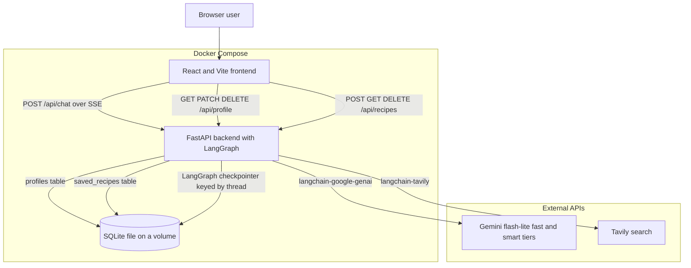
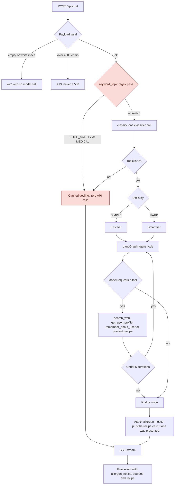
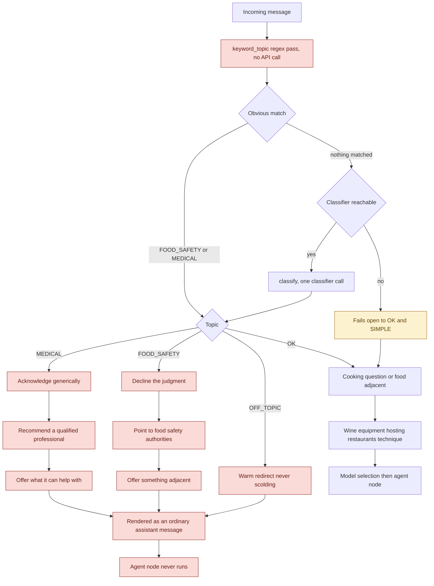
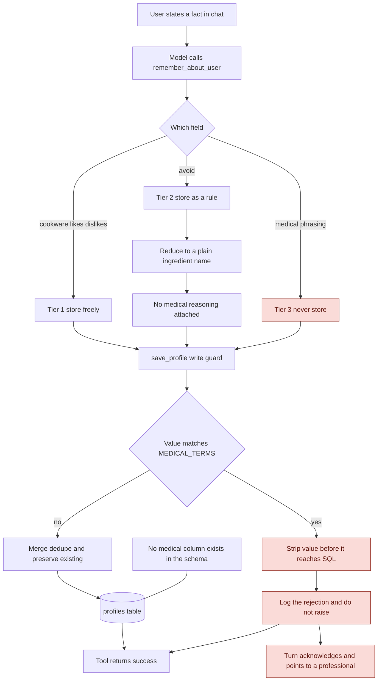
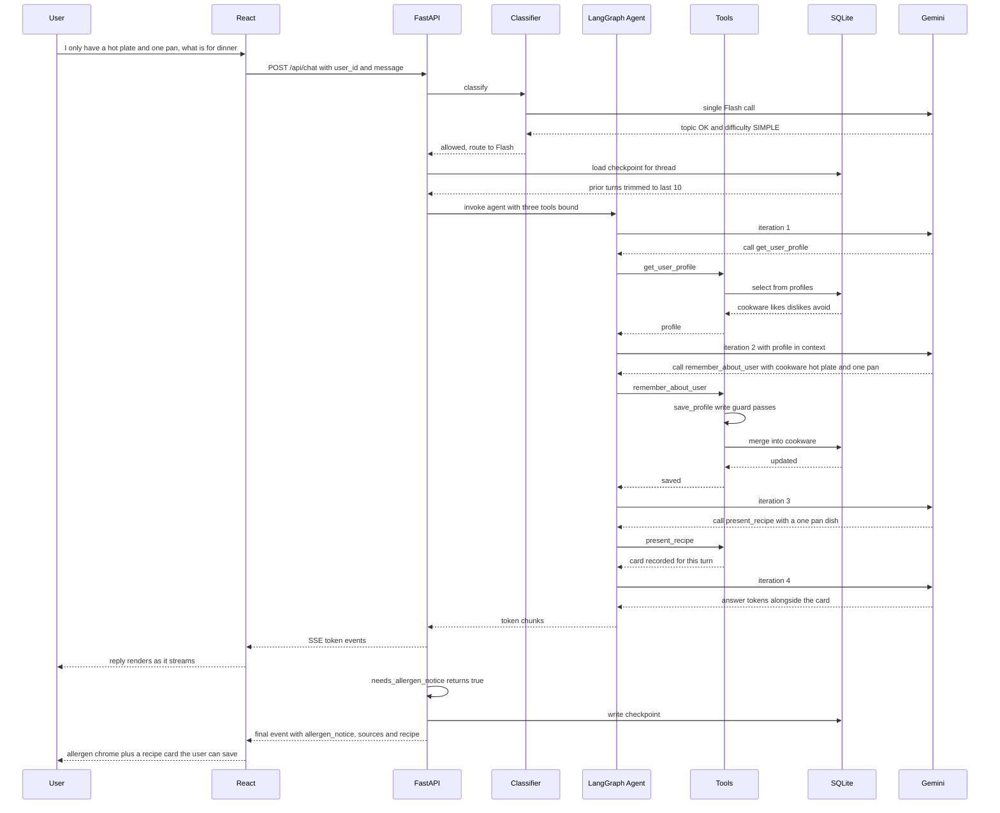
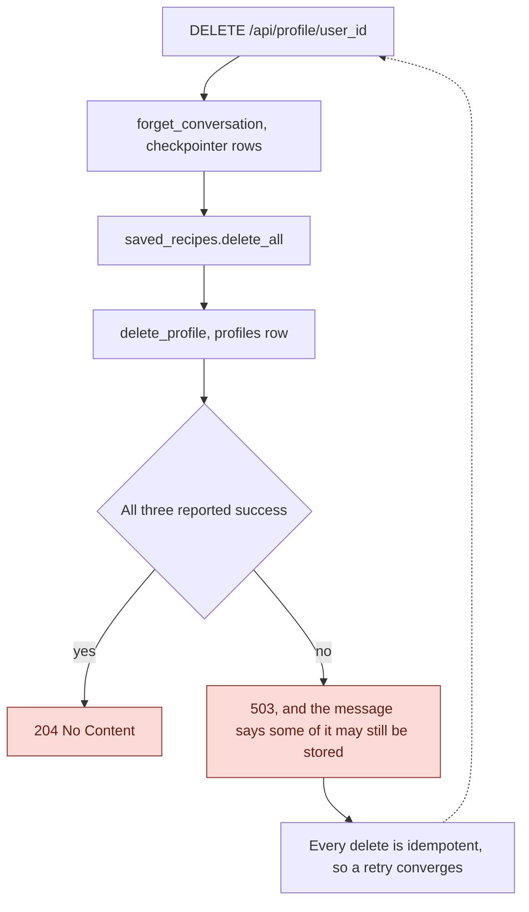

# PantryPal v1: Architecture

Diagrams of the system as it shipped, redrawn after the build. They started as diagrams of the spec in `PRD.md` and drifted, so they now follow the code rather than the plan. Reasoning behind the decisions lives in `SCOPING.md`, and what the plan got wrong is listed there under "Where this document drifted."

---

## 1. System overview

Two Compose services and two outbound dependencies. The frontend never talks to the database or to either external API directly. Everything goes through FastAPI, which is what makes the write guard in diagram 4 unavoidable rather than advisory. SQLite carries three workloads: the structured `profiles` table, the `saved_recipes` table, and the LangGraph conversation checkpointer. All three matter to diagram 6, because a deletion request has to clear all of them. Both Gemini tiers are reached through LangChain, never a vendor SDK, which is a hard README requirement. Both are flash-lite models, since every Pro tier is quota-zero on a free key. `/health` exists for the Compose healthcheck. If the database is unavailable the chat still answers with memory degraded and says so, so the DB edges are not on the critical path for a reply.

---

## 2. Request flow through the graph

Two gates, in this order, and the order is the point. A regex pass runs first and costs nothing, so an obvious food-safety or medical question is declined without any API call at all and without the message ever being handed to a model that could be argued with. Only what the regex does not recognise reaches `classify()`, which returns topic and difficulty together, so the policy check costs nothing extra on top of routing.

The blocked branches, shaded, short-circuit before the agent node executes. On the allowed path, difficulty picks the tier and the agent loops freely: the model chooses which of the four tools to call and in what order, and there is no fixed sequence anywhere in the graph. The only ceiling is the hard cap of 5 iterations, which all four tools now share.

The allergen notice is attached by the server after the answer is settled, never authored by the model. It fires on every substantive reply rather than on a judgment about whether one named an ingredient, and it fires if a recipe card is present even when the prose alone would not have triggered it.

---

## 3. Policy decision tree

Four outcomes, three of which terminate before the agent. The regex pass at the top is the part worth reading twice: it runs before any model call, so instruction-shaped text in the message has nothing to argue with, and an obvious block costs zero API quota. Only unmatched messages reach the classifier.

The shaded amber node is the honest part. `classify()` fails open to OK when the classifier is unreachable, which means a degraded classifier lets through anything the regex did not already catch. That is a deliberate choice, because failing closed would turn a model outage into a product that declines every question, but it is the reason the regex layer exists at all. It also falls unevenly: the regexes are English, so a non-English speaker loses the backstop that an English speaker keeps. That is written up in `TRADEOFFS.md`.

The shape of every decline is the same: acknowledge, redirect to the right authority, then immediately offer something useful, which is the never-bare-refuse pattern also used when a recipe does not fit the user's cookware. These render as normal assistant turns, not error states, because the CEO explicitly did not want the product to read as a narc. The `OK` branch is deliberately generous: wine, equipment, hosting, restaurants, and technique all resolve to `OK` and reach the agent. Restaurant *discussion* is in scope; live restaurant lookup is not built.

---

## 4. Profile write path

This is the diagram that reconciles the CEO's headline memory feature with counsel's data restriction, and it is the most load-bearing part of the build. Three tiers. Preferences and equipment persist normally. An allergy persists as a behavioral exclusion only. `shellfish` lands in `avoid` as a bare ingredient name, with the reason it is there deliberately not recorded, which delivers "don't suggest shrimp" while storing a filter rule rather than a diagnosis. Medical conditions are never written: acknowledged in the reply, pointed to a professional, dropped before SQL.

The property that matters is that `remember_about_user` is model-driven, so the model will eventually attempt to write a condition. The prompt is not the defense. `save_profile` is, and it strips matches against `MEDICAL_TERMS` on every path, including the ones the model believes are safe. Rejections are logged and the tool still returns successfully, so a blocked write never surfaces to the user as a failure. Two things make this structural rather than conventional: the guard sits on the only write path, and the schema has no medical column to write into even if the guard were bypassed. A test asserts that "diabetic" never reaches the table regardless of what the model sends.

The limit of the diagram is the `CK` node. `MEDICAL_TERMS` is a finite list, so what it does not recognise it does not strip. The guard cannot be bypassed or argued out of, but it can be walked around by a phrasing nobody thought of. `TRADEOFFS.md` says which phrasings, and why widening the list is harder than it looks.

---

## 5. Chat turn sequence

A realistic turn, and the one the demo script in `PRD.md` section 11 exercises. The agent takes four passes through the model here: read the profile, write the new cookware fact, present the card, then answer. Nothing forces that order. The model chose to read before answering and to persist the hot plate on its own, and a different turn would produce a different call pattern or none at all. Most turns call no tools and carry no card.

The saved cookware is what makes the same question answerable after a container restart, which is the point of the scripted demo. Note the two-part response contract: tokens stream first so time-to-first-token stays low, then a single final event carries `allergen_notice`, `sources` and `recipe`. The notice is computed server-side by `needs_allergen_notice`, which keeps it consistent by construction and keeps the assistant's prose unhedged.

This is also where the four-tool loop starts to press against its ceiling. Four passes fits inside the cap of 5, but a turn that searched twice before finding a recipe worth showing would not have room left to present it.

---

## 6. Deletion across three stores

The one route where a lie costs more than a failure. Three stores have to be cleared and they cannot share a transaction, because the checkpointer owns its own connection and SQLite has no cross-connection transaction. So the design gives up atomicity and buys convergence instead: every delete is idempotent, the conversation goes first, and the route answers 204 only when all three succeeded. A partial failure leaves a retry that finishes the job.

The ordering is deliberate. The conversation transcript is the store most likely to contain something the profile write guard refused to record, so it goes first and a failure part way through leaves the least sensitive material behind rather than the most.

This route had a real bug that a green test suite did not catch: `delete_profile` returned success even when its write threw, so the route answered 204 over data that was still stored. `TRADEOFFS.md` has the account of how that survived.

---

## Reading order

Diagram 1 for what runs where. Diagram 2 for the path of a single request. Diagrams 3, 4 and 6 are the legal boundaries: 3 covers what the assistant will not discuss, 4 covers what the system will not store, and 6 covers what it has to be able to erase. Diagram 5 shows the whole thing working on the demo case.
